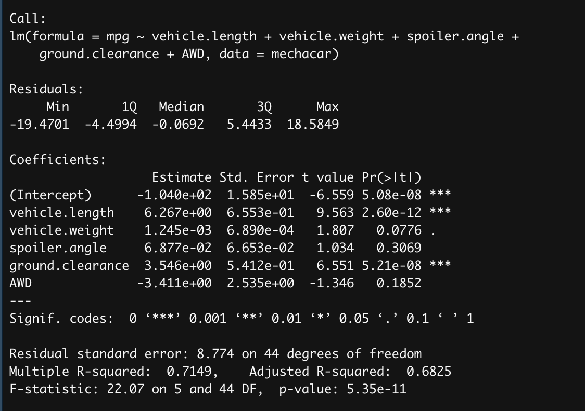
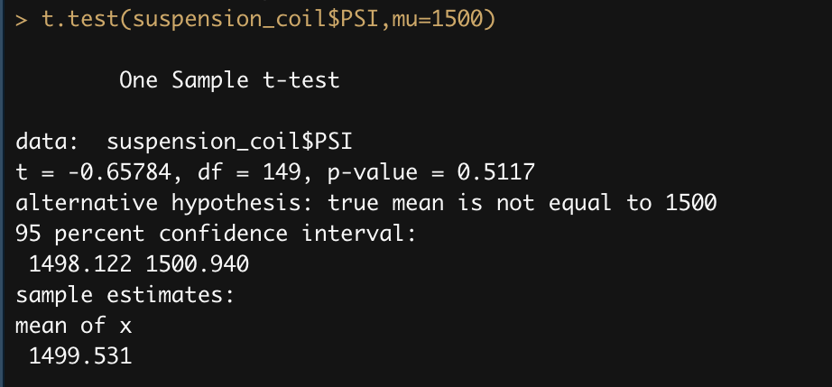
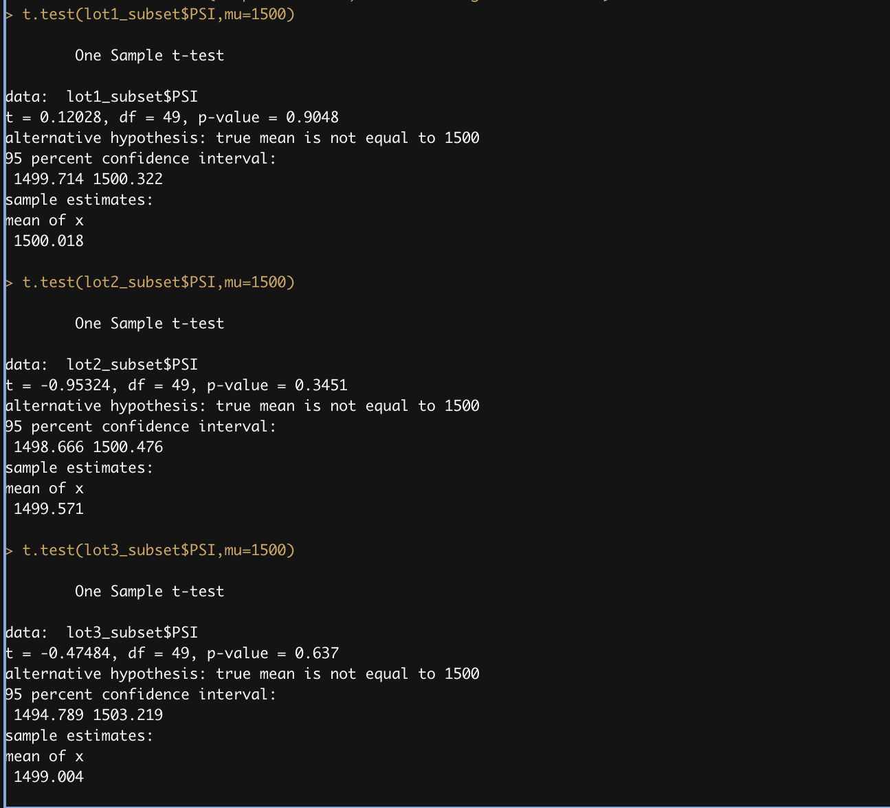

# MechaCar_Statistical_Analysis

## Linear Regression to Predict MPG

Vehicle Lenght and ground clearance provided a non-random amount of variance to the mpg values in the dataset.
From our linear regression model, the R-squared value is 0.7149, which means that roughly 71% of predictions will be correct when using this linear model. In addition, the p-value of our linear regression analysis is 5.35e-11, which is much smaller than our assumed significance level of 0.05%. Therefore, we can state that there is sufficient evidence to reject our null hypothesis, which means that the slope of our linear model is not zero.

## Summary Statistics on Suspension Coils

The design specifications for the MechaCar suspension coils dictate that the variance of the suspension coils must not exceed 100 pounds per square inch which is true for all manufacturing lots in total (Variance = 76.23459), however, when we look at each lot individually not all of them meet that specification. According to the table above only Lot1 and Lot2 meet the design specification. Lot3 doesn't meet because it variance is 220.010563 which way above 100. 

## T-Tests on Suspension Coils

Our p-value is equal to 0.5117 which is more than 0.05, therefore we can not reject the null hypothesis. 

The other t-test results are also not statistically different from the population mean of 1,500 pounds per square inch. P-values for Lot1, Lot2, and Lot3 are 0.9048. 03451, and 0.637 respectively and are more than 0.05. We can not reject the null hypothesis.

## Study Design: MechaCar vs Competition

To see how the MechaCar performs against the competition we are going to conduct a statistical study. 
We are going to use safety rating as our metric. 
To test the hypothesis we would use a t-test. We'll test the mean of a single group (MechaCar) against another known mean (the competition).
A one-sample t-test is used to test the following hypotheses:

H0 : There is no statistical difference between the observed sample mean and its presumed population mean.
Ha : There is a statistical difference between the observed sample mean and its presumed population mean.

To run a statistical test we would need "crash" data. 

